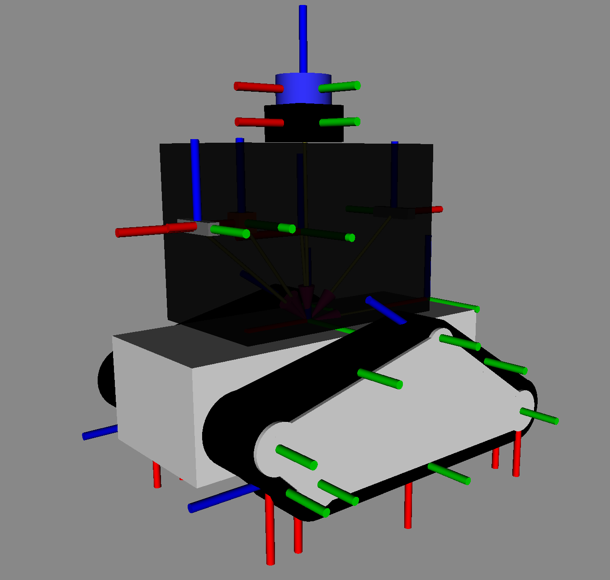

# Jo Description

A comprehensive ROS 2 robot description package for the Jo tracked robot platform, featuring complete robot modeling, and simulated sensors.

<div align="center">
  
</div>


## Building
 
```bash
cd ~/ros2_ws
colcon build --packages-select jo_description
source install/setup.bash
```
 
## Usage
 
### Launch only Robot State Publisher
 
```bash
ros2 launch jo_description description.launch.py
```

### Launch with RViz
```bash
ros2 launch jo_description description.launch.py use_rviz:=true
```


## Package Structure
 
```
jo_description/
├── CMakeLists.txt
├── launch
│   └── description.launch.py
├── package.xml
├── README.md
├── res
│   └── description.png
├── rviz
│   └── display.rviz
└── urdf
    ├── back_depth.xacro                    # Simulated D455
    ├── front_depth.xacro                   # Simulated D455
    ├── imu.xacro                           # Simulated IMU
    ├── inertial_macros.xacro              
    ├── jo_main.urdf.xacro                  # Main xacro file
    ├── robot_core.xacro                    # Robot's body URDF
    ├── track.xacro                         # Simulated tracks description
    └── velodyne.xacro                      # Simulated lidar

```
 